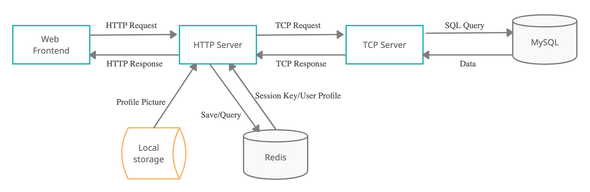

# Entry Task
## Deployment
### Requirement: 
-   MySQL 5.7
-   Redis
-   Nginx
-   Golang
-   Python - for generate user data for testing
-   Lua - for load test

### Steps:
1. Clone this repo.
2. Start MySQL at port 3306 and Redis at port 6379. 
3. Setup Systemd unit file. 
    * Change environment variable `ENTRY_TASK_DEPLOY_PATH` in `scripts/goweb.service` to `{CURRENT_PATH}/deploy` 
    ```
    sudo cp scripts/goweb.service /lib/systemd/system/goweb.service
    sudo cp scripts/gotcp.service /lib/systemd/system/gotcp.service
    ```
4. Setup Nginx configuration file. Here we assume our IP address is `10.143.139.181`.
   *
   ```
   sudo mv scripts/10.143.139.181 /etc/nginx/sites-available/10.143.139.181
   sudo ln -s /etc/nginx/sites-available/your_domain /etc/nginx/sites-enabled/your_domain
   sudo nginx -s reload
   ```
5. Populate data into MySQL.
   ```
   cd mysql
   source populate.sh
   ```
6. Run start script.
   ```
   source deploy.sh
   ```
7. Done

## Design
### Overall Architecture


### Communication
Communication between TCP and HTTP server are implemented by socket programming. The message are serialized by using [Protocol Buffers](https://developers.google.com/protocol-buffers), which is faster than XML or JSON. TCP server are designed to be ablt to listen to multiple connection concurrently. HTTP server maintains a connection pool to decrease the connection overhead.

### Session Management
JWT is used for managing user authentication session. Token will be set as cookie after user login. Token contains tokenId and username. The tokenId-username key-value pair will be stored in Redis. This will be removed from Redis when user logged out to achieve the session termination.

### Redis Cache
User information will be stored in redis temporary. This decrease the need to obtain data from MySQL database through communicating with TCP Server. User data can be obtained by `username` key which contained in JWT. 

### Systemd Unit
To ensure the reliability of the server, Systemd unit files are used to auto restart the program when it fails after 5 seconds.

### Security
* Password of user are hashed before storing in database
* Parametrized queries for preventing SQL Injection
* Cookies are set as `http-only` to prevent XSS
* JWT secret are stored in `.env` file instead of contained in code
* Server seperation
* Reversed proxy

## Testing
### Tools
[Wrk](https://github.com/wg/wrk) are used for load test and the test script could be easily written in Lua. CPU, memory usage, network usage, IO usage are also be recorded during the testing.

### Performance test report
* `performance_test/wrk.txt`: Output of load test
* `performcance_test/log.txt`: Device usage including CPU, memory, network and IO

## Conclusion
I learnt a lot when doing this task, especially Golang, as well as practiced some skills that I learned before. The key takeaways of this task is that, although something might seem easy, it is still worth rethinking and we might learn something new from that.